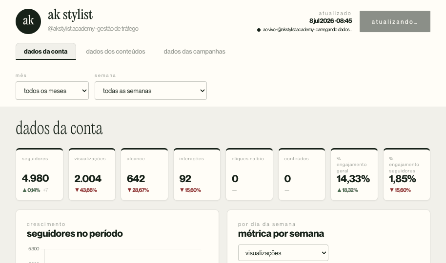

# AK Stylist — Gestão de Tráfego

Painel de análise de performance do Instagram **@akstylist.academy** e das campanhas de tráfego pago (Facebook/Meta Ads) por objetivo, com dados servidos **ao vivo** pelos conectores da **Windsor.ai**.



---

## O que é

Aplicação de **página única** que roda 100% no navegador, sem build/bundler. A interface é um único **Design Component** (`Dashboard.dc.html`) renderizado por um runtime React leve (`support.js`). Os gráficos usam **Chart.js**.

O painel tem três páginas:

- **Dados da Conta** — KPIs do período (seguidores, visualizações, alcance, interações, cliques na bio, conteúdos, % de engajamento) + gráficos de crescimento de seguidores e métricas por dia da semana.
- **Dados dos Conteúdos** — grade de cards de todas as publicações, com capa (inclusive reels), tipo, data, métricas estilo Instagram e taxas de engajamento/salvamento/compartilhamento.
- **Dados das Campanhas** — três abas:
  - **Vendas** — filtro **Produtos** (SDM / SFC / TDD). Funil de conversão do Facebook Ads (Alcance → Impressões → Cliques → Visualizações da página → Finalização de compra → Vendas do gerenciador) + tabelas de anúncios e conjuntos.
  - **Leads** — funil Alcance → Impressões → Cliques → Visualizações da página → Leads, com KPIs de CPL, CTR e CPM.
  - **Novos Seguidores** — campanhas de tráfego para perfil: funil até visitas ao perfil, distribuição de orçamento e tabela de anúncios de perfil, além do crescimento orgânico e demografia da audiência.

As tabelas de anúncios e conjuntos são **ordenáveis por coluna** (clique no cabeçalho: maior→menor; clique de novo inverte).

---

## Como rodar

É estático — basta servir os arquivos e abrir no navegador.

```bash
# qualquer servidor estático serve; ex.:
python3 -m http.server 8000
# depois acesse http://localhost:8000/  (o vercel.json redireciona / para Dashboard.dc.html)
```

> Abrir o arquivo direto via `file://` pode falhar por causa do carregamento de módulos/fontes — prefira um servidor estático local ou o deploy no Vercel.

O painel busca os dados ao vivo na carga (Instagram + Facebook Ads pela Windsor.ai). Sem rede, mostra o último estado conhecido em cache.

---

## Deploy no Vercel

O `vercel.json` faz o *rewrite* de `/` para `/Dashboard.dc.html`, então a URL fica limpa (sem `/Dashboard.dc.html` no fim).

```json
{ "rewrites": [ { "source": "/", "destination": "/Dashboard.dc.html" } ] }
```

Basta importar o repositório no Vercel (sem framework / build — projeto estático) ou arrastar a pasta no dashboard do Vercel.

---

## Estrutura

```
.
├── Dashboard.dc.html          Aplicação — toda a UI e a lógica de dados
├── support.js                 Runtime do Design Component (React leve) — não editar
├── vercel.json                Rewrite de / → Dashboard.dc.html
├── _ds/
│   └── l-marques-design-system-…/   Tokens de marca (cores, tipografia, fontes)
│       ├── tokens/*.css
│       ├── styles.css
│       ├── _ds_bundle.js
│       └── assets/fonts/
└── docs/
    ├── ARQUITETURA.md         Referência técnica (modelo de dados, fórmulas, limitações)
    └── preview.png
```

---

## Fontes de dados

- **Instagram (Windsor.ai)** — perfil, série diária (views, alcance, interações), saldo de seguidores, demografia da audiência e publicações de **@akstylist.academy**.
- **Facebook Ads (Windsor.ai)** — conta `504057149034541`, dados desde **jan/2025**. As campanhas são classificadas por objetivo/produto pelo nome:
  - **Vendas** — `[SDM]`, `[SFC][VENDA]`, `[TDD]`
  - **Leads** — `[SFC][CAP]`
  - **Novos Seguidores** — tráfego para perfil / `[VISITA]` / aumento de base
  - Métricas: gasto, impressões, alcance, cliques, visualizações de página, finalização de compra e conversões, por anúncio e por conjunto.

### Cache local (`localStorage`)

- **Publicações** — a 1ª carga semeia ~180 dias; as atualizações seguintes buscam só os últimos ~30 dias e mesclam com o cache. As **capas** desde janeiro/2026 são baixadas e **embutidas como imagem** (JPEG reduzido), para continuarem aparecendo mesmo após as URLs do Instagram expirarem.
- **Facebook Ads** — histórico (jan/2025 em diante) fica em cache (`akAdsCampaigns:v2`); os 3 dias anteriores à atualização são sempre revalidados ao vivo.
- O app limpa automaticamente versões antigas de cache na carga, para não estourar a quota do navegador.

---

## Stack

HTML + React 18 (via runtime do Design Component) + Chart.js. Sem JSX, sem bundler, sem dependências de build.
